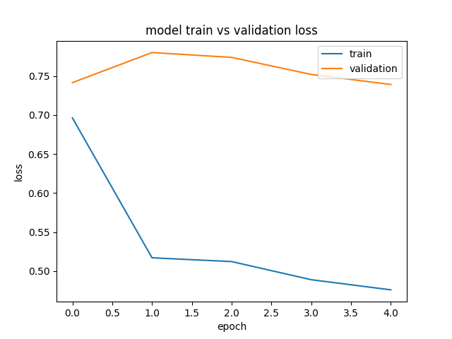
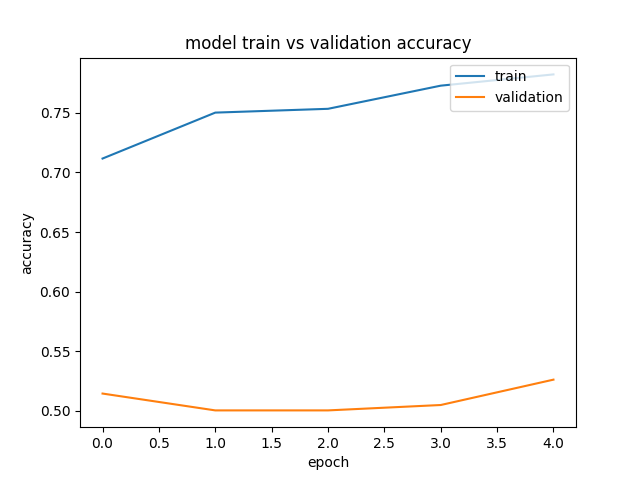

# CNN con Glove embeddings

## Informacion
Uso de una CNN para clasificacion de textos hiper-partidistas. 
1. Preprocesamiento
* Vocabulario de 200 mil más frecuentes
* Incluye stop words
* Glove 100 d
* Máxima Longitud de Articulo de 800
2. Modelo
* 100 mil entrenamiento, 40 mil validación
* Capa embeddings
* 2 capas convolucionales de 128 neuronas cada una con filtros de 5x5 y regularización L2
* Capa de GlobalMaxPooling1D
* 2 capas completamente conectadas una de 128 neuronas y la segunda de 1 neurona. 
* Se usa dropout en las capas convolucionales y usamos una entropia cruzada binaria como función de perdida.

## Instrucciones
1. Ir a la carpeta de CNN
2. Verificar las configuraciones de los archivos de entrenamiento, validacion y test en config.py
3. Correr idToLabel.py para la obtencion de un mapa de articulo->clasificacion usando los datos groudTruth
  * python idToLabel.py train
  * python idToLabel.py validate
  * python idToLabel.py test
4. Correr preprocessing.py para pre-procesar los datos
5. Correr CNN.py

## Resultados
Entrenamiento 100,000 datos

En validacion de datos por publisher:

| Accuracy | Precision | Recall  | F1  |
|----------|-----------|---------|-----|
|0.526|0.514|0.922|0.66|

En validacion de datos manuales:

| Accuracy | Precision | Recall  | F1  |
|----------|-----------|---------|-----|
|0.472|0.408|0.957|0.572|

