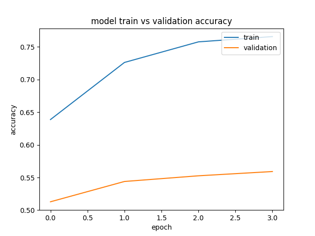

# Gru con Glove embeddings

## Informacion
Uso de una RNN de tipo Gru para clasificacion de textos hiper-partidistas. 
1. Preprocesamiento
* Vocabulario de 200 mil más frecuentes
* Incluye stop words
* Glove 100 d
* Máxima Longitud de Articulo de 800
2. Modelo
* 100 mil entrenamiento, 40 mil validación
* Capa Embedding, Gru(10), Densa(1)
* Batch Normalization, kernel regularizer(.01), recurrent regularizer(.01)
* Entropia cruzada binaria
* 5 epochs, batches 64

## Instrucciones
1. Ir a la carpeta de simpleRNN
2. Verificar las configuraciones de los archivos de entrenamiento, validacion y test en config.py
3. Correr idToLabel.py para la obtencion de un mapa de articulo->clasificacion usando los datos groudTruth
  * python idToLabel.py train
  * python idToLabel.py validate
  * python idToLabel.py test
4. Correr preprocessing.py para pre-procesar los datos
5. Correr RNN_embb.py

## Resultados
Entrenamiento 100,000 datos

En validacion de datos por publisher:

| Accuracy | Precision | Recall  | F1  |
|----------|-----------|---------|-----|
|0.5591|0.543|0.7439|0.627|

En validacion de datos manuales:

| Accuracy | Precision | Recall  | F1  |
|----------|-----------|---------|-----|
|0.553|0.442|0.8067|0.5714|

Results in test Data
Accuracy 0.553488372093
Precision 0.442396313364
Recall 0.806722689076
F1 0.571428571429

